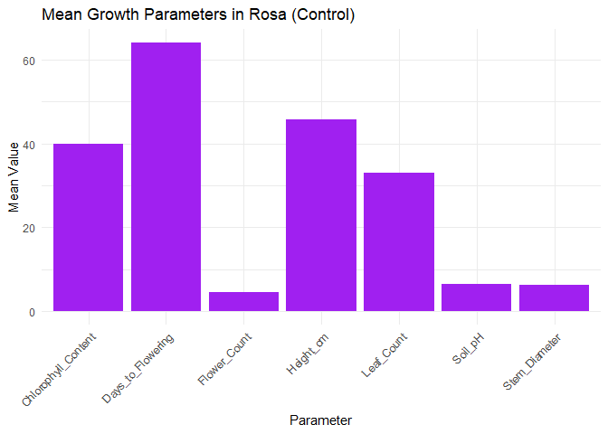
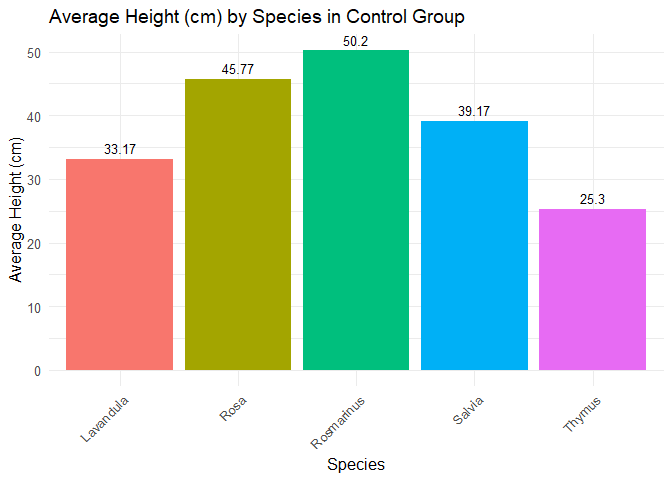
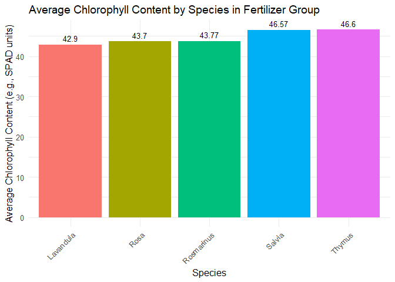
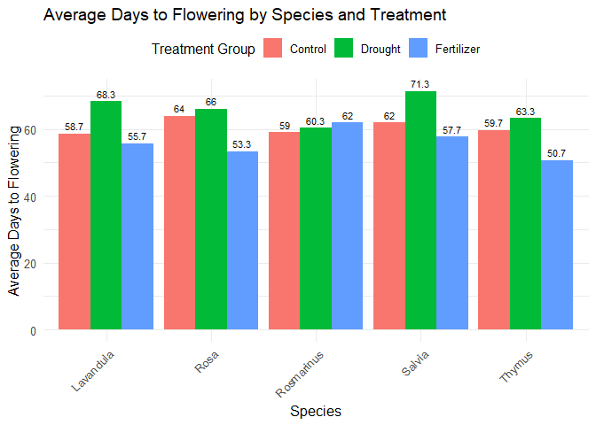

plant_growth
================
sathita
2025-05-04

``` r
options(repos = c(CRAN = "https://cran.r-project.org"))
```

``` r
plant_growth_data <- read.csv("plant_growth_data.csv")
```

``` r
head(plant_growth_data)
```

    ##   Plant_ID Species  Treatment Height_cm Leaf_Count Flower_Count Soil_pH
    ## 1        1    Rosa    Control      43.3         29            5     6.7
    ## 2        2    Rosa    Control      44.3         33            5     6.2
    ## 3        3    Rosa    Control      49.7         37            4     6.6
    ## 4        4    Rosa Fertilizer      53.2         46            6     7.2
    ## 5        5    Rosa Fertilizer      53.4         42            9     6.5
    ## 6        6    Rosa Fertilizer      58.1         48            6     6.9
    ##   Chlorophyll_Content Stem_Diameter Days_to_Flowering
    ## 1                36.8           6.6                64
    ## 2                43.8           5.9                65
    ## 3                39.0           6.7                63
    ## 4                42.4           8.9                48
    ## 5                44.3           7.0                59
    ## 6                44.4          10.7                53

``` r
library(dplyr)
```

    ## 
    ## Attaching package: 'dplyr'

    ## The following objects are masked from 'package:stats':
    ## 
    ##     filter, lag

    ## The following objects are masked from 'package:base':
    ## 
    ##     intersect, setdiff, setequal, union

``` r
library(ggplot2)
```

``` r
# คำถามข้อ 1
# 1. Find the mean of Height_cm, Leaf_Count, Flower_Count, Soil_pH, Chlorophyll_Content, Stem_Diameter, and Days_to_Flowering for each Species and Treatment.
# 1. หาค่าเฉลี่ยของ Height_cm, Leaf_Count, Flower_Count, Soil_pH, Chlorophyll_Content, Stem_Diameter และ Days_to_Flowering สำหรับแต่ละ Species และ Treatment
# คำตอบข้อที่ 1
# คำนวณค่าเฉลี่ยตาม Species และ Treatment

summary_data <- plant_growth_data %>%
  group_by(Species, Treatment) %>%
  summarise(
    avg_Height_cm = mean(Height_cm, na.rm = TRUE),
    avg_Leaf_Count = mean(Leaf_Count, na.rm = TRUE),
    avg_Flower_Count = mean(Flower_Count, na.rm = TRUE),
    avg_Soil_pH = mean(Soil_pH, na.rm = TRUE),
    avg_Chlorophyll_Content = mean(Chlorophyll_Content, na.rm = TRUE),
    avg_Stem_Diameter = mean(Stem_Diameter, na.rm = TRUE),
    avg_Days_to_Flowering = mean(Days_to_Flowering, na.rm = TRUE)
  )
```

    ## `summarise()` has grouped output by 'Species'. You can override using the
    ## `.groups` argument.

``` r
# แสดงผลด้วย
 print(summary_data)
```

    ## # A tibble: 15 × 9
    ## # Groups:   Species [5]
    ##    Species   Treatment avg_Height_cm avg_Leaf_Count avg_Flower_Count avg_Soil_pH
    ##    <chr>     <chr>             <dbl>          <dbl>            <dbl>       <dbl>
    ##  1 Lavandula Control            33.2           26               9           6.27
    ##  2 Lavandula Drought            25.3           19.7             6.67        6.57
    ##  3 Lavandula Fertiliz…          39.9           33.7            12.3         6.87
    ##  4 Rosa      Control            45.8           33               4.67        6.5 
    ##  5 Rosa      Drought            36.5           31.3             3.67        6.17
    ##  6 Rosa      Fertiliz…          54.9           45.3             7           6.87
    ##  7 Rosmarin… Control            50.2           41.3             5.67        6.63
    ##  8 Rosmarin… Drought            45.1           38.3             2.67        6.43
    ##  9 Rosmarin… Fertiliz…          56.7           47              10           6.7 
    ## 10 Salvia    Control            39.2           28.7             7.67        6.4 
    ## 11 Salvia    Drought            31.5           24               6.33        6.37
    ## 12 Salvia    Fertiliz…          46             39              10.7         6.87
    ## 13 Thymus    Control            25.3           19.7            13.7         6.57
    ## 14 Thymus    Drought            20.4           16.3            13.7         6.47
    ## 15 Thymus    Fertiliz…          34.0           26.3            17.3         6.83
    ## # ℹ 3 more variables: avg_Chlorophyll_Content <dbl>, avg_Stem_Diameter <dbl>,
    ## #   avg_Days_to_Flowering <dbl>

``` r
# คำถามข้อ 2
# 2. Create a new data frame containing Species, Treatment, and the means of each parameter.Use head() to display your new data frame
# 2. สร้าง data frame ใหม่ที่ประกอบด้วย Species, Treatment และค่าเฉลี่ยของพารามิเตอร์แต่ละตัว ใช้ head() เพื่อแสดง data frame ใหม่ของคุณ
# คำตอบข้อที่ 2
# แสดงผลด้วย head()
 head(summary_data)
```

    ## # A tibble: 6 × 9
    ## # Groups:   Species [2]
    ##   Species   Treatment  avg_Height_cm avg_Leaf_Count avg_Flower_Count avg_Soil_pH
    ##   <chr>     <chr>              <dbl>          <dbl>            <dbl>       <dbl>
    ## 1 Lavandula Control             33.2           26               9           6.27
    ## 2 Lavandula Drought             25.3           19.7             6.67        6.57
    ## 3 Lavandula Fertilizer          39.9           33.7            12.3         6.87
    ## 4 Rosa      Control             45.8           33               4.67        6.5 
    ## 5 Rosa      Drought             36.5           31.3             3.67        6.17
    ## 6 Rosa      Fertilizer          54.9           45.3             7           6.87
    ## # ℹ 3 more variables: avg_Chlorophyll_Content <dbl>, avg_Stem_Diameter <dbl>,
    ## #   avg_Days_to_Flowering <dbl>

``` r
# คำถามข้อ 3
# 3. Plot a bar graph of Height_cm, Leaf_Count, Flower_Count, Soil_pH, Chlorophyll_Content, Stem_Diameter, and Days_to_Flowering for Rosa/Control (Use the mean of each measurement).
# 3. พล็อตกราฟแท่งของ Height_cm, Leaf_Count, Flower_Count, Soil_pH, Chlorophyll_Content, Stem_Diameter และ Days_to_Flowering ใน Rosa/Control (ใช้ค่าเฉลี่ยของแต่ละการวัด)
# คำตอบข้อ 3
rosa_control_means <- plant_growth_data %>%
  filter(Species == "Rosa", Treatment == "Control") %>%
  summarise(
    Height_cm = mean(Height_cm, na.rm = TRUE),
    Leaf_Count = mean(Leaf_Count, na.rm = TRUE),
    Flower_Count = mean(Flower_Count, na.rm = TRUE),
    Soil_pH = mean(Soil_pH, na.rm = TRUE),
    Chlorophyll_Content = mean(Chlorophyll_Content, na.rm = TRUE),
    Stem_Diameter = mean(Stem_Diameter, na.rm = TRUE),
    Days_to_Flowering = mean(Days_to_Flowering, na.rm = TRUE)
  )

print(rosa_control_means) 
```

    ##   Height_cm Leaf_Count Flower_Count Soil_pH Chlorophyll_Content Stem_Diameter
    ## 1  45.76667         33     4.666667     6.5            39.86667           6.4
    ##   Days_to_Flowering
    ## 1                64

``` r
library(dplyr)
library(ggplot2)
```

``` r
# แปลงให้อยู่ในรูป long format สำหรับการพล็อตกราฟ ggplot
rosa_long <- tidyr::pivot_longer(
  rosa_control_means,
  cols = everything(),
  names_to = "Parameter",
  values_to = "Mean_Value"
)
```

``` r
install.packages("tidyr")
```

    ## Installing package into 'C:/Users/advic/AppData/Local/R/win-library/4.5'
    ## (as 'lib' is unspecified)

    ## package 'tidyr' successfully unpacked and MD5 sums checked

    ## Warning: cannot remove prior installation of package 'tidyr'

    ## Warning in file.copy(savedcopy, lib, recursive = TRUE): problem copying
    ## C:\Users\advic\AppData\Local\R\win-library\4.5\00LOCK\tidyr\libs\x64\tidyr.dll
    ## to C:\Users\advic\AppData\Local\R\win-library\4.5\tidyr\libs\x64\tidyr.dll:
    ## Permission denied

    ## Warning: restored 'tidyr'

    ## 
    ## The downloaded binary packages are in
    ##  C:\Users\advic\AppData\Local\Temp\Rtmps7XFvn\downloaded_packages

``` r
# แปลงให้อยู่ในรูป long format สำหรับการพล็อตกราฟ ggplot
rosa_long <- tidyr::pivot_longer(
  rosa_control_means,
  cols = everything(),
  names_to = "Parameter",
  values_to = "Mean_Value"
)
# สร้างกราฟแท่ง
ggplot(rosa_long, aes(x = Parameter, y = Mean_Value)) +
  geom_col(fill = "purple") +
  labs(
    title = "Mean Growth Parameters in Rosa (Control)",
    x = "Parameter",
    y = "Mean Value"
  ) +
  theme_minimal() +
  theme(axis.text.x = element_text(angle = 45, hjust = 1))
```

<!-- -->

``` r
# คำถามข้อ 4
# 4. Compare the mean of Height_cm between Species in the control group using bar graphs.
# 4. เปรียบเทียบค่าเฉลี่ยของ Height_cm ระหว่าง Species ในกลุ่ม control โดยใช้กราฟแท่ง
# ตรวจสอบให้แน่ใจว่าคุณได้โหลด package ที่จำเป็นแล้ว
# library(dplyr) # ถ้ายังไม่ได้โหลด
# library(ggplot2) # ถ้ายังไม่ได้โหลด

# สมมติว่า data frame ของคุณชื่อ plant_growth_data และได้โหลดเข้ามาเรียบร้อยแล้ว

# 1. กรองข้อมูลเฉพาะกลุ่ม Control และคำนวณค่าเฉลี่ย Height_cm ของแต่ละ Species
control_species_height_avg <- plant_growth_data %>%
  filter(Treatment == "Control") %>%          # เลือกเฉพาะกลุ่ม Control
  group_by(Species) %>%                       # จัดกลุ่มตาม Species
  summarise(
    Mean_Height_cm = mean(Height_cm, na.rm = TRUE) # คำนวณค่าเฉลี่ยความสูง
  )

# ตรวจสอบผลลัพธ์ (optional)
print(control_species_height_avg)
```

    ## # A tibble: 5 × 2
    ##   Species    Mean_Height_cm
    ##   <chr>               <dbl>
    ## 1 Lavandula            33.2
    ## 2 Rosa                 45.8
    ## 3 Rosmarinus           50.2
    ## 4 Salvia               39.2
    ## 5 Thymus               25.3

``` r
# 2. สร้างกราฟแท่งเปรียบเทียบค่าเฉลี่ย Height_cm ระหว่าง Species ในกลุ่ม Control
ggplot(control_species_height_avg, aes(x = Species, y = Mean_Height_cm, fill = Species)) +
  geom_col(show.legend = FALSE) + # geom_col สำหรับค่า y ที่คำนวณไว้แล้ว, show.legend=FALSE เพราะสีซ้ำซ้อนกับแกน x
  geom_text(aes(label = round(Mean_Height_cm, 2)), vjust = -0.5, size = 3.5) + # แสดงตัวเลขค่าเฉลี่ยบนแท่ง
  labs(
    title = "Average Height (cm) by Species in Control Group",
    x = "Species",
    y = "Average Height (cm)"
  ) +
  theme_minimal(base_size = 12) +
  theme(axis.text.x = element_text(angle = 45, hjust = 1, vjust = 1)) # หมุนชื่อแกน X ให้อ่านง่าย (ถ้าชื่อ Species ยาว)
```

<!-- -->

``` r
# คำถามข้อ 5
# 5. Compare the mean of Chlorophyll_Content between Species in the fertilizer group using bar graphs.
# 5. เปรียบเทียบค่าเฉลี่ยของ Chlorophyll_Content ระหว่าง Species ในกลุ่ม fertilizer โดยใช้กราฟแท่ง
# สมมติว่า data frame ของคุณชื่อ plant_growth_data และได้โหลดเข้ามาเรียบร้อยแล้ว
# และมีคอลัมน์ Treatment, Species, และ Chlorophyll_Content

# 1. กรองข้อมูลเฉพาะกลุ่ม Fertilizer และคำนวณค่าเฉลี่ย Chlorophyll_Content ของแต่ละ Species
fertilizer_species_chloro_avg <- plant_growth_data %>%
  filter(Treatment == "Fertilizer") %>%       # เลือกเฉพาะกลุ่ม Fertilizer (ตรวจสอบชื่อให้ตรงกับในข้อมูลของคุณ)
  group_by(Species) %>%                       # จัดกลุ่มตาม Species
  summarise(
    Mean_Chlorophyll = mean(Chlorophyll_Content, na.rm = TRUE) # คำนวณค่าเฉลี่ย Chlorophyll Content
  )

# ตรวจสอบผลลัพธ์ (optional)
print(fertilizer_species_chloro_avg)
```

    ## # A tibble: 5 × 2
    ##   Species    Mean_Chlorophyll
    ##   <chr>                 <dbl>
    ## 1 Lavandula              42.9
    ## 2 Rosa                   43.7
    ## 3 Rosmarinus             43.8
    ## 4 Salvia                 46.6
    ## 5 Thymus                 46.6

``` r
# 2. สร้างกราฟแท่งเปรียบเทียบค่าเฉลี่ย Chlorophyll_Content ระหว่าง Species ในกลุ่ม Fertilizer
ggplot(fertilizer_species_chloro_avg, aes(x = Species, y = Mean_Chlorophyll, fill = Species)) +
  geom_col(show.legend = FALSE) + # geom_col สำหรับค่า y ที่คำนวณไว้แล้ว
  geom_text(aes(label = round(Mean_Chlorophyll, 2)), vjust = -0.5, size = 3.5) + # แสดงตัวเลขค่าเฉลี่ยบนแท่ง
  labs(
    title = "Average Chlorophyll Content by Species in Fertilizer Group",
    x = "Species",
    y = "Average Chlorophyll Content (e.g., SPAD units)" # ปรับหน่วยตามข้อมูลจริง
  ) +
  theme_minimal(base_size = 12) +
  theme(axis.text.x = element_text(angle = 45, hjust = 1, vjust = 1)) # หมุนชื่อแกน X ให้อ่านง่าย
```

<!-- -->

``` r
# คำถาม 6
# 6. Compare the mean of Days_to_Flowering for all Species and Treatments using bar graphs.
# 6. เปรียบเทียบค่าเฉลี่ยของ Days_to_Flowering ของทุก Species และ Treatment โดยใช้กราฟแท่ง
# คำตอบข้อที่ 6
# ตรวจสอบให้แน่ใจว่าคุณได้โหลด package ที่จำเป็นแล้ว
# library(dplyr)     # ถ้ายังไม่ได้โหลด
# library(ggplot2)   # ถ้ายังไม่ได้โหลด

# สมมติว่า data frame ของคุณชื่อ plant_growth_data และได้โหลดเข้ามาเรียบร้อยแล้ว
# และมีคอลัมน์ Species, Treatment, และ Days_to_Flowering

# 1. คำนวณค่าเฉลี่ย Days_to_Flowering สำหรับแต่ละการรวมกันของ Species และ Treatment
species_treatment_flowering_avg <- plant_growth_data %>%
  group_by(Species, Treatment) %>%                       # จัดกลุ่มตาม Species และ Treatment
  summarise(
    Mean_Days_to_Flowering = mean(Days_to_Flowering, na.rm = TRUE), # คำนวณค่าเฉลี่ย
    .groups = 'drop' #  .groups = 'drop' เป็น good practice หลัง summarise
  )

# ตรวจสอบผลลัพธ์ (optional)
print(species_treatment_flowering_avg)
```

    ## # A tibble: 15 × 3
    ##    Species    Treatment  Mean_Days_to_Flowering
    ##    <chr>      <chr>                       <dbl>
    ##  1 Lavandula  Control                      58.7
    ##  2 Lavandula  Drought                      68.3
    ##  3 Lavandula  Fertilizer                   55.7
    ##  4 Rosa       Control                      64  
    ##  5 Rosa       Drought                      66  
    ##  6 Rosa       Fertilizer                   53.3
    ##  7 Rosmarinus Control                      59  
    ##  8 Rosmarinus Drought                      60.3
    ##  9 Rosmarinus Fertilizer                   62  
    ## 10 Salvia     Control                      62  
    ## 11 Salvia     Drought                      71.3
    ## 12 Salvia     Fertilizer                   57.7
    ## 13 Thymus     Control                      59.7
    ## 14 Thymus     Drought                      63.3
    ## 15 Thymus     Fertilizer                   50.7

``` r
# 2. สร้างกราฟแท่งแบบกลุ่มเปรียบเทียบค่าเฉลี่ย Days_to_Flowering
ggplot(species_treatment_flowering_avg, aes(x = Species, y = Mean_Days_to_Flowering, fill = Treatment)) +
  geom_col(position = "dodge") + # "dodge" เพื่อให้แท่งของ Treatment ต่างๆ แสดงข้างกันสำหรับแต่ละ Species
  geom_text(
    aes(label = round(Mean_Days_to_Flowering, 1)), # แสดงตัวเลขค่าเฉลี่ย (ทศนิยม 1 ตำแหน่ง)
    position = position_dodge(width = 0.9),    # จัดตำแหน่งตัวเลขให้ตรงกับแท่งที่ dodge
    vjust = -0.5,                              # ปรับตำแหน่งแนวตั้งของตัวเลข (ให้อยู่เหนือแท่ง)
    size = 3                                   # ขนาดตัวอักษร
  ) +
  labs(
    title = "Average Days to Flowering by Species and Treatment",
    x = "Species",
    y = "Average Days to Flowering",
    fill = "Treatment Group" # เปลี่ยนชื่อ legend ให้สื่อความหมาย
  ) +
  theme_minimal(base_size = 12) +
  theme(
    axis.text.x = element_text(angle = 45, hjust = 1, vjust = 1), # หมุนชื่อแกน X
    legend.position = "top" # หรือ "bottom", "right", "left" ตามความเหมาะสม
  )
```

<!-- -->
